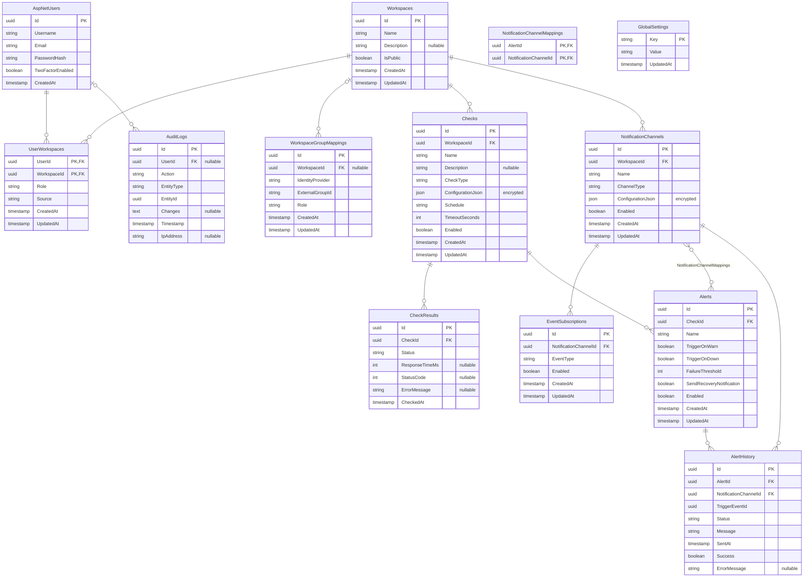

# Database Schema

```mermaid
erDiagram
    AspNetUsers ||--o{ UserWorkspaces : ""
    AspNetUsers o|--o{ AuditLogs : ""
    Workspaces ||--o{ UserWorkspaces : ""
    Workspaces o|--o{ WorkspaceGroupMappings : ""
    Workspaces ||--o{ Checks : ""
    Workspaces ||--o{ NotificationChannels : ""
    NotificationChannels ||--o{ EventSubscriptions : ""
    Checks ||--o{ CheckResults : ""
    Checks ||--o{ Alerts : ""
    NotificationChannels }o--o{ Alerts : "NotificationChannelMappings"
    Alerts ||--o{ AlertHistory : ""
    NotificationChannels ||--o{ AlertHistory : ""

    AspNetUsers {
        uuid Id PK
        string Username
        string Email
        string PasswordHash
        boolean TwoFactorEnabled
        timestamp CreatedAt
    }

    Workspaces {
        uuid Id PK
        string Name
        string Description "nullable"
        boolean IsPublic
        timestamp CreatedAt
        timestamp UpdatedAt
    }

    UserWorkspaces {
        uuid UserId PK,FK
        uuid WorkspaceId PK,FK
        string Role
        string Source
        timestamp CreatedAt
        timestamp UpdatedAt
    }

    WorkspaceGroupMappings {
        uuid Id PK
        uuid WorkspaceId FK "nullable"
        string IdentityProvider
        string ExternalGroupId
        string Role
        timestamp CreatedAt
        timestamp UpdatedAt
    }

    NotificationChannels {
        uuid Id PK
        uuid WorkspaceId FK
        string Name
        string ChannelType
        json ConfigurationJson "encrypted"
        boolean Enabled
        timestamp CreatedAt
        timestamp UpdatedAt
    }

    EventSubscriptions {
        uuid Id PK
        uuid NotificationChannelId FK
        string EventType
        boolean Enabled
        timestamp CreatedAt
        timestamp UpdatedAt
    }

    Checks {
        uuid Id PK
        uuid WorkspaceId FK
        string Name
        string Description "nullable"
        string CheckType
        json ConfigurationJson "encrypted"
        string Schedule
        int TimeoutSeconds
        boolean Enabled
        timestamp CreatedAt
        timestamp UpdatedAt
    }

    CheckResults {
        uuid Id PK
        uuid CheckId FK
        string Status
        int ResponseTimeMs "nullable"
        int StatusCode "nullable"
        string ErrorMessage "nullable"
        timestamp CheckedAt
    }

    Alerts {
        uuid Id PK
        uuid CheckId FK
        string Name
        boolean TriggerOnWarn
        boolean TriggerOnDown
        int FailureThreshold
        boolean SendRecoveryNotification
        boolean Enabled
        timestamp CreatedAt
        timestamp UpdatedAt
    }

    NotificationChannelMappings {
        uuid AlertId PK,FK
        uuid NotificationChannelId PK,FK
    }

    AlertHistory {
        uuid Id PK
        uuid AlertId FK
        uuid NotificationChannelId FK
        uuid TriggerEventId
        string Status
        string Message
        timestamp SentAt
        boolean Success
        string ErrorMessage "nullable"
    }

    AuditLogs {
        uuid Id PK
        uuid UserId FK "nullable"
        string Action
        string EntityType
        uuid EntityId
        text Changes "nullable"
        timestamp Timestamp
        string IpAddress "nullable"
    }

    GlobalSettings {
        string Key PK
        string Value
        timestamp UpdatedAt
    }
```
